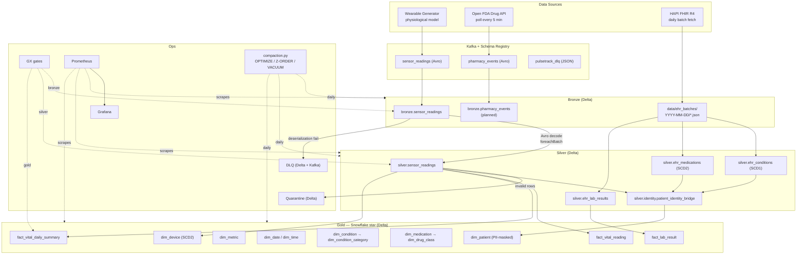
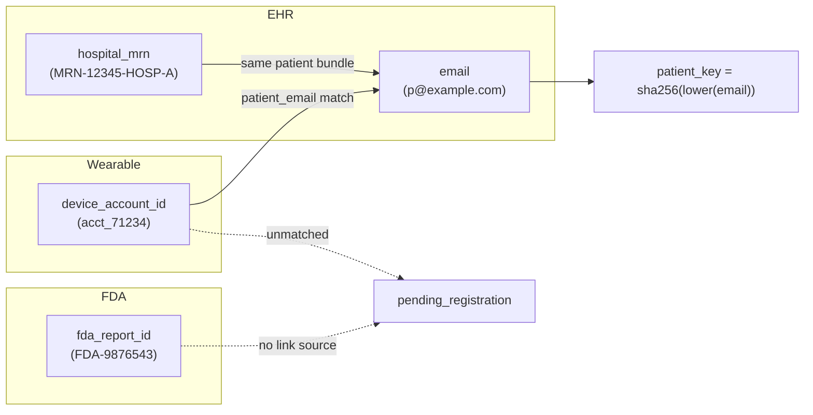

# PulseTrack — Architecture Reference

## Overview

End-to-end healthcare analytics platform. Three real data sources flow
through a Kappa-architecture lakehouse on Delta Lake into a Snowflake-schema
analytical model. The wearable path is true Spark Structured Streaming;
EHR + dimension paths run as batch through the same Spark engine via the
same DataFrame API. Both paths share a single set of `run_streaming()` /
`run_batch()` entrypoints — that's the canonical "one engine, two
triggers, identical transform code" Kappa property.

**Pattern:** Kappa (one engine, streaming-first, batch-when-natural)
**Modeling:** Snowflake schema in Gold (normalized hierarchies on
condition_category, drug_class)
**Wire format:** Avro through Confluent Schema Registry on Kafka
**Quality:** Great Expectations 1.x + DLQ + per-layer Quarantine
**Storage:** Delta Lake 3.0 with autoOptimize + Z-ORDER maintenance

---

## Data flow

---

## Why Kappa here (not Lambda)

Sensor readings are append-only — a heart-rate at 14:34 doesn't get
"corrected" later, only superseded by future readings. That removes
Lambda's primary justification (reconciling a stateful business event
between fast and slow paths). PulseTrack therefore picks Kappa:

- **One processing engine** — Spark Structured Streaming is the canonical
  driver. Each transform exposes both `run_streaming()` and `run_batch()`,
  but they share the same per-row logic.
- **Backfill = replay** — to reprocess a window, reset Kafka offsets (or
  re-read the Bronze partitions) and run the same code. MERGE is
  idempotent so duplicates don't accumulate.
- **Late data via watermarks** — Silver applies
  `withWatermark("event_timestamp", "10 minutes")` and
  `dropDuplicatesWithinWatermark(["reading_id","metric_name"])`. Late
  events outside the watermark are quarantined, not silently dropped.

### Kappa ≠ "everything streams"

Kappa means **one engine**, not **one mode**. The wearable path is true
Structured Streaming. The EHR path arrives as daily file drops; its Silver
and Gold jobs run in batch through the same Spark engine and the same
DataFrame API. That's the canonical "same code, different trigger"
pattern — backfills reuse the streaming logic in batch mode without
duplication.

| | Streaming wearable | Batch EHR / dims |
|---|---|---|
| Source | Kafka (`sensor_readings`) | `data/ehr_batches/*.json` |
| Trigger | `processingTime=30s` micro-batches | Single batch |
| Sink | Delta MERGE in `foreachBatch` | Delta MERGE / overwrite |
| Code | `sensor_silver.run_streaming()` | `sensor_silver.run_batch()` |
| Identical transform fn? | Yes — `transform(bronze)` | Yes — same `transform(bronze)` |

---

## Component catalog

| Component | Role | Code |
|---|---|---|
| Wearable generator | Physiological vitals over Kafka | `data_generators/wearable_generator.py` + `vitals_model.py` |
| Open FDA producer | Adverse-event reports → Kafka | `data_generators/openfda_producer.py` |
| FHIR producer | EHR batches from HAPI server | `data_generators/fhir_producer.py` |
| Schema Registry | Avro contract enforcement | `schemas/registry.py` + `*.avsc` |
| Bronze ingestion | Kafka → Delta (raw + decoded) | `streaming/bronze_ingestion.py` |
| DLQ | Failed deserialization sink | `streaming/dlq.py` (Delta + Kafka) |
| Quarantine | Failed quality-rule sink | `data_quality/quarantine.py` |
| Silver sensor | Explode + flag + dedup + MERGE | `transformations/bronze_to_silver/sensor_silver.py` |
| Silver EHR | FHIR JSON → conditions/meds/labs | `transformations/bronze_to_silver/ehr_silver.py` |
| Identity bridge | 4-type identifier resolution | `transformations/identity_resolution/patient_identity_bridge.py` |
| Gold dims | dim_patient, dim_device, etc. | `transformations/silver_to_gold/dim_*.py` |
| Gold facts | Daily summary, atomic readings, lab results | `transformations/silver_to_gold/fact_*.py` |
| Quality gates | GX 1.x suites | `data_quality/gx_config.py` + `expectations/*` |
| Compaction | OPTIMIZE/Z-ORDER/VACUUM/TBLPROPERTIES | `maintenance/compaction.py` |
| Observability | Prometheus + Grafana | `metrics.py` + `monitoring/*` |

---

## Identity resolution (4 identifier types)

Phases (executed in order in `run_identity_bridge`):

1. **EHR** — every `(MRN, email)` pair from `silver.ehr_conditions ∪
   silver.ehr_medications` produces two `linked` rows (`hospital_mrn` +
   `email`) tied to a `patient_key = sha256(email)`.
2. **Devices (transitive)** — wearable events now carry `patient_email`.
   The bridge looks up that email in the just-written `email` rows; on a
   match the device is `linked / exact_email_match`, otherwise
   `pending_registration`.
3. **FDA reports** — every distinct `fda_report_id` from
   `bronze.pharmacy_events` (when that table exists) lands as
   `pending_registration` until a future linkage source connects pseudo-IDs
   to real patients.
4. **Resolution metrics** — `data_quality/identity_metrics.py` publishes
   `pt_identity_link_rate_pct`, `pt_identity_unique_patients`,
   `pt_identity_pending_rows`, `pt_identity_avg_ids_per_patient`.

---

## Late-arriving data

Wearables batch-sync — a reading taken at 09:00 may not arrive until
17:00. The pipeline handles this in three places:

1. **Silver** flags `is_late_arriving` when
   `sync_timestamp − event_timestamp > 7200s` (configurable via
   `PT_LATE_ARRIVAL_THRESHOLD_SECONDS`).
2. **Watermark** at 10 minutes prevents stale state from accumulating in
   `dropDuplicatesWithinWatermark`. Beyond that window, late dupes appear
   as new rows but are caught by the MERGE on `(reading_id, metric_name)`.
3. **Gold daily summary** re-reads only the slice of Silver matching
   `(device_account_id, metric_name, device_type, event_date)` tuples
   touched by the current batch, recomputes the daily aggregates, and
   MERGEs on `(patient_key, metric_key, date_key)` — so late readings
   correctly update the existing daily row.

---

## Failure modes & response

| Failure | Where | Sink | Reason label |
|---|---|---|---|
| Avro decode fails | Bronze ingestion | DLQ (Delta + Kafka) | `avro_deserialization_failure` |
| Out-of-range metric value | Silver `add_quality_flags` | Quarantine | column name (`is_valid`) |
| GX expectation fails | Silver / Gold gate | metric counter, MERGE skipped | `quality_gate` |
| Kafka delivery error | Producer | metric counter | `delivery_error` |
| API 429 / 5xx | OpenFDA / FHIR producer | retry then metric counter | `api_error` |
| Spark write contention | Maintenance | `@retry` then metric counter | exception class |

Tools:

- **`@retry`** decorator at `utils/retry.py` (exponential backoff,
  selective exception filter)
- **Graceful shutdown** at `utils/streaming.setup_graceful_shutdown` —
  SIGTERM/SIGINT calls `query.stop()` then `spark.stop()` before exit so
  the checkpoint is left consistent

---

## What's planned

- **Bronze pharmacy consumer** — symmetric to `bronze_ingestion.py` but on
  the `pharmacy_events` topic; would unblock the FDA bridge phase.
- **Silver pharmacy** — drug enrichment, NDC join, dedup on
  `safetyreportid`.
- **ML feature store** on `fact_vital_reading` for an anomaly classifier.
- **Airflow DAGs** for batch orchestration (currently driven by `make`).
