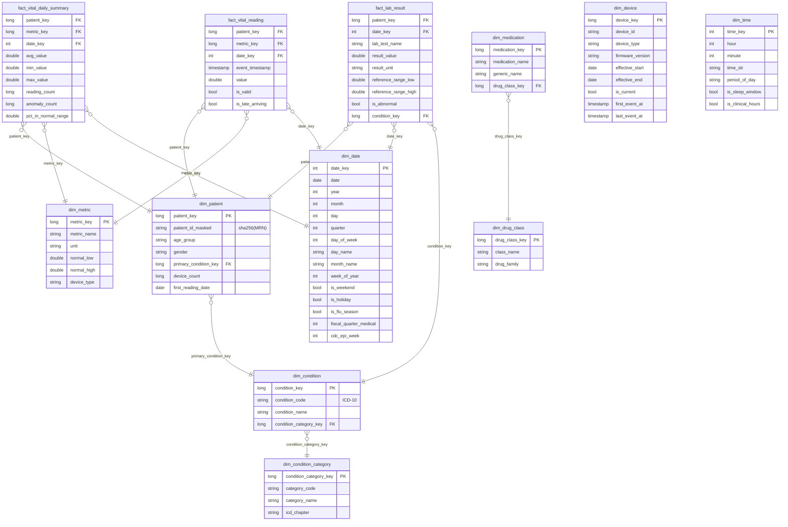

# PulseTrack — Data Model

This file documents every Bronze, Silver, and Gold table produced by the
pipeline. The Gold schema is a Snowflake star (normalized hierarchies on
`condition_category` and `drug_class`).

---

## Snowflake schema (Gold)

---

## Bronze tables

| Table | Path | Partition by | Source | Notes |
|---|---|---|---|---|
| `bronze.sensor_readings` | `${LH}/bronze/sensor_readings` | `(ingestion_date, ingestion_hour)` | Kafka `sensor_readings` (Avro) | Raw bytes + decoded struct + `is_parseable` flag |
| `bronze.pharmacy_events` *(planned)* | `${LH}/bronze/pharmacy_events` | `(ingestion_date, ingestion_hour)` | Kafka `pharmacy_events` (Avro) | Producer exists; consumer not yet written |

Bronze sensor schema:

| Column | Type | Source |
|---|---|---|
| `raw_avro_bytes` | binary | Kafka `value` (full wire-format payload) |
| `decoded` | struct | `from_avro(payload, schema, mode=PERMISSIVE)` |
| `is_parseable` | boolean | `decoded.reading_id IS NOT NULL` |
| `kafka_topic` / `kafka_partition` / `kafka_offset` / `kafka_timestamp` / `kafka_key` | envelope | passed through |
| `ingestion_timestamp` / `ingestion_date` / `ingestion_hour` | timestamp / string | Spark `current_timestamp()` |

---

## Silver tables

| Table | Grain | Pattern | Source |
|---|---|---|---|
| `silver.sensor_readings` | 1 reading × 1 metric | streaming MERGE | Bronze sensor |
| `silver.ehr_conditions` | 1 patient × 1 ICD-10 | SCD1 MERGE | EHR JSON batch |
| `silver.ehr_medications` | 1 patient × 1 drug × effective period | SCD2 (row_hash on status, dosage, frequency) | EHR JSON batch |
| `silver.ehr_lab_results` | 1 patient × 1 test × 1 date | append-only | EHR JSON batch |
| `silver.identity.patient_identity_bridge` | 1 identifier_value × 1 identifier_type | MERGE on `(identifier_type, identifier_value)` | union of EHR + sensor + pharmacy |

`silver.sensor_readings` columns:

| Column | Type | Notes |
|---|---|---|
| `reading_id` | string | natural key |
| `device_id`, `device_type`, `device_account_id`, `firmware_version`, `battery_pct` | string / int | from decoded Avro |
| `patient_email` | string | enables transitive bridge linkage |
| `metric_name` | string | `heart_rate_bpm`, `spo2_pct`, `hrv_ms`, `skin_temp_celsius`, `steps_since_last`, `respiration_rate`, `sleep_stage`, `bp_systolic_mmhg`, `bp_diastolic_mmhg` |
| `metric_value` | double | exploded from `decoded.metrics` map |
| `event_timestamp`, `sync_timestamp`, `ingestion_timestamp` | timestamp | dual timestamps for late-data tracking |
| `is_valid` | boolean | per-metric range check (`METRIC_RANGES`) |
| `is_late_arriving` | boolean | `sync − event > settings.late_arrival_threshold_seconds` |

`patient_identity_bridge` rows:

| Column | Type |
|---|---|
| `patient_key` | string (sha256 of email; nullable when pending) |
| `identifier_type` | enum: `hospital_mrn`, `email`, `device_account_id`, `fda_report_id` |
| `identifier_value` | string |
| `source` | string: `ehr_batch`, `wearable`, `pharmacy_fda` |
| `link_status` | enum: `linked`, `pending_registration` |
| `match_method` | enum: `exact_mrn_email`, `exact_email_match`, `none` |
| `first_seen`, `last_seen` | timestamp |

---

## Gold tables — facts

### `fact_vital_daily_summary`

- **Grain:** 1 patient × 1 metric × 1 calendar day
- **Source:** `silver.sensor_readings`
- **Pattern:** streaming `foreachBatch` recompute on touched grain keys + MERGE
- **Excludes** `sleep_stage` (categorical; carried by `fact_vital_reading`)

### `fact_vital_reading`

- **Grain:** 1 patient × 1 metric × 1 event_timestamp
- **Source:** `silver.sensor_readings`
- **Pattern:** streaming MERGE on `(patient_key, metric_key, event_timestamp)`
- **Use case:** ML features, ad-hoc trace queries

### `fact_lab_result`

- **Grain:** 1 patient × 1 lab test × 1 test date
- **Source:** `silver.ehr_lab_results`
- **Pattern:** batch overwrite (lab results are immutable historical facts)
- **Clinical mapping** wired into `condition_key`:
  - `HbA1c → E11.9` (Type 2 diabetes)
  - `LDL → E78.5` (Hyperlipidemia)
  - `BP_systolic → I10` (Essential hypertension)

---

## Gold tables — dimensions

| Dim | Grain | Type | Notes |
|---|---|---|---|
| `dim_patient` | 1 row per patient | conformed | PII-masked: `patient_id_masked = sha256(MRN)`; numeric `patient_key` surrogate |
| `dim_device` | 1 row per (device, firmware) | SCD2 | `effective_start/end`, `is_current`; rebuilt deterministically from Silver |
| `dim_metric` | 1 row per (metric_name, device_type) | junk | physiological normal_low/normal_high used by Gold's `pct_in_normal_range` |
| `dim_date` | 1 row per calendar day, 2024-01-01 → 2026-12-31 | role-playing | US holidays, fiscal-year-medical, CDC epi week |
| `dim_time` | 1 row per (hour, minute), 00:00 → 23:59 | role-playing | period_of_day, is_sleep_window, is_clinical_hours |
| `dim_condition_category` | 1 row per ICD-10 chapter | parent of dim_condition | category_code, icd_chapter |
| `dim_condition` | 1 row per ICD-10 code | child of dim_condition_category | FK to category |
| `dim_drug_class` | 1 row per pharmacological class | parent of dim_medication | class_name, drug_family |
| `dim_medication` | 1 row per (medication_name, generic) | child of dim_drug_class | FK to drug_class |

---

## Operational tables

| Table | Path | Purpose |
|---|---|---|
| DLQ | `${LH}/dlq` | Records that failed Avro decode (10-column schema with original Kafka envelope + error trace + `failed_at`) |
| Quarantine | `${LH}/quarantine` | Records that parsed but failed quality validation. `mergeSchema=true` so the table absorbs new columns over time |

---

## Surrogate key strategy

- **Patient surrogate:** `patient_key (long) = abs(hash(sha256(email)))` —
  consistent across all sources via the identity bridge
- **Device surrogate:** `device_key (long) = abs(hash(device_id|firmware|first_seen))` — encodes the SCD2 version
- **Metric surrogate:** `metric_key (long) = abs(hash(metric_name|device_type))` — junk dimension key
- **Condition / medication / drug class surrogates:** `abs(hash(natural_key))` for stable round-tripping
- **Date surrogate:** `date_key (int) = year*10000 + month*100 + day` (YYYYMMDD)
- **Time surrogate:** `time_key (int) = hour*100 + minute` (HHMM)

---

## Schema evolution

`spark.databricks.delta.schema.autoMerge.enabled=true` is set
session-wide so MERGE statements absorb new upstream columns without
breaking. New tables inherit `optimizeWrite`, `autoCompact`,
`logRetention=30d`, `deletedFileRetention=7d` via
`spark.databricks.delta.properties.defaults.*`. Existing tables get the
same properties applied via `maintenance/compaction.py`'s ALTER TABLE.

---

## Maintenance / Z-ORDER plan

| Table | Z-ORDER columns | Rationale |
|---|---|---|
| `bronze.sensor_readings` | `ingestion_date` | partition pruning by date |
| `silver.sensor_readings` | `device_type, metric_name` | most-common filter / join keys |
| `silver.ehr_conditions` | `patient_id` | patient lookups |
| `silver.ehr_medications` | `patient_id, medication` | SCD2 lookups |
| `silver.ehr_lab_results` | `patient_id, test_code` | lab joins |
| `silver.identity.patient_identity_bridge` | `identifier_type` | type-scoped scans |
| `gold.fact_vital_daily_summary` | `patient_key, date_key` | dashboard query pattern |
| `gold.fact_vital_reading` | `patient_key, date_key` | trace/feature lookups |
| `gold.fact_lab_result` | `patient_key, date_key` | longitudinal lab queries |
| `gold.dim_device` | `device_id` | SCD2 history lookups |
| Other dims | none | already small enough |

VACUUM retention: 168 hours (7 days). Run via
`python maintenance/compaction.py` (daily off-peak).
