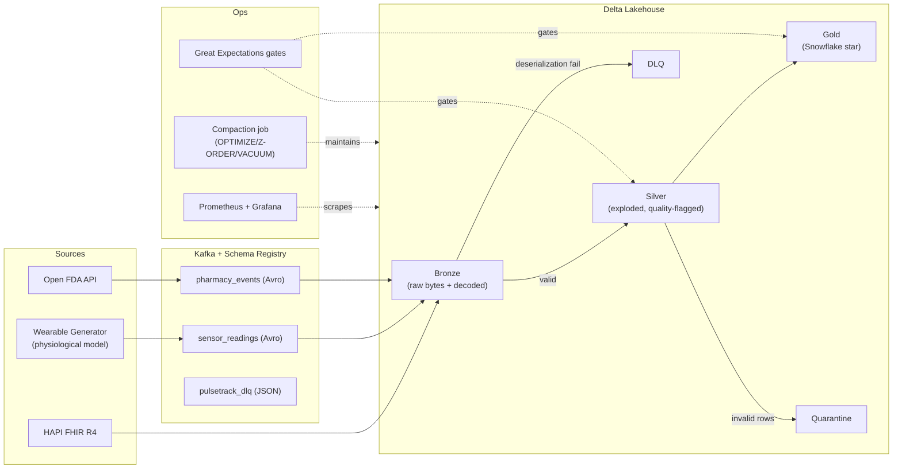

# PulseTrack

> Wearable health analytics platform — physiological vitals, FHIR clinical
> data, and FDA pharmacy events flowing through a Kappa-architecture
> lakehouse on Delta Lake.


---

## What this is

PulseTrack ingests three classes of healthcare telemetry:

1. **Wearable sensor readings** — physiologically-realistic vitals (HR, SpO2,
   HRV, skin temp, BP, steps, sleep stage) generated from a Markov-chain
   activity model + circadian rhythm + per-patient baselines.
   Avro-encoded onto Kafka via Schema Registry.
2. **EHR clinical bundles** — pulled live from the public HAPI FHIR R4
   server and dropped as daily JSON batches under `data/ehr_batches/`.
3. **Pharmacy adverse-event reports** — pulled from the Open FDA API and
   produced to Kafka with the same Avro/Schema-Registry discipline.

It lands them through a Bronze → Silver → Gold medallion into a
**Snowflake-schema** analytical model on Delta Lake. The wearable path is
true Spark Structured Streaming; the EHR and dimension paths run as batch
jobs through the same Spark engine — that's Kappa: one engine, two
triggers, identical transform code (`run_streaming()` / `run_batch()`).

---

## Architecture (high-level)



---

## What's implemented today

| Area | Status | Notes |
|---|---|---|
| Pydantic config + structured JSON logging | ✅ | `config.py`, `logger.py` |
| Prometheus metrics module | ✅ | `metrics.py` — counters/histograms/gauges + `start_metrics_server()` |
| Docker Compose stack | ✅ | Kafka, ZooKeeper, Schema Registry, Spark master/worker, Azurite, Prometheus, Grafana |
| Avro Schema Registry | ✅ | `schemas/sensor_reading.avsc`, `schemas/pharmacy_event.avsc`, `schemas/registry.py` |
| Physiological vitals simulator | ✅ | Markov chain × circadian × anomaly injection (`data_generators/vitals_model.py`) |
| Open FDA producer | ✅ | Backfill + 5-min poll loop, offset persistence, `@retry` |
| HAPI FHIR producer | ✅ | Daily batch fetch with pydantic v1/v2 compat |
| Bronze ingestion (sensor) | ✅ | Avro decode, DLQ on failure, `maxOffsetsPerTrigger`, signal handlers |
| Bronze ingestion (pharmacy) | ⚠️ | Producer exists; Kafka→Delta consumer not yet written |
| Silver sensor (streaming + batch) | ✅ | Watermark + `dropDuplicatesWithinWatermark` + MERGE |
| Silver EHR (batch) | ✅ | Conditions (SCD1), Medications (SCD2), Lab observations |
| Silver pharmacy | ⚠️ | Schema and producer exist; transform not yet written |
| Identity bridge | ✅ | 4 identifier types, transitive email→patient_key linkage, FDA report IDs (when bronze pharmacy lands) |
| Gold dimensions | ✅ | dim_patient (PII-masked), dim_device (SCD2), dim_metric, dim_date, dim_time, dim_condition + dim_condition_category, dim_medication + dim_drug_class |
| Gold facts | ✅ | fact_vital_daily_summary (streaming + batch), fact_vital_reading (streaming + batch), fact_lab_result |
| DLQ + Quarantine | ✅ | DLQ writes Delta + Kafka; Quarantine writes Delta with retry |
| Quality gates | ✅ | Great Expectations 1.x suites for Bronze, Silver, Gold |
| Maintenance job | ✅ | OPTIMIZE / Z-ORDER / VACUUM / TBLPROPERTIES across 21 tables |
| Tests | ✅ | 82 passing, 77% coverage |
| CI/CD | ✅ | GitHub Actions: lint, test (with `--cov-fail-under=70`), security scan |

---

## Quick start

```bash
# 1. Bring up the stack
docker-compose up -d

# 2. Install Python deps + pre-commit
make setup

# 3. Generate some EHR data (writes to data/ehr_batches/)
make generate-ehr

# 4. Start Avro-encoded vitals on Kafka in the background
make generate-vitals

# 5. Run the Bronze ingestion (consumes Kafka → Delta)
make stream-bronze

# 6. In another shell, run Silver streaming
make stream-silver

# 7. Build all dimensions + identity bridge + Gold facts (batch)
make batch-silver
make identity
make batch-gold

# 8. Audit data quality
make quality

# 9. Optimize and vacuum
make compact

# 10. View dashboards
open http://localhost:3000        # Grafana (admin/admin)
open http://localhost:9090        # Prometheus
open http://localhost:8081/subjects   # Schema Registry
```

---

## Tests

```bash
export JAVA_HOME=$(/usr/libexec/java_home -v 17 2>/dev/null || echo "$JAVA_HOME")
make test
```

Current results: **82 passed / 0 failed / 37 skipped, 77% line coverage**
(target: 70%). The skipped suites cover:

- `test_gold.py` — auto-engages after a real pipeline run populates `/tmp/pulsetrack-lakehouse/gold/*`
- `test_pharmacy_silver.py` — placeholders for the not-yet-written pharmacy Silver transform
- `tests/integration/` — gated on `RUN_INTEGRATION_TESTS=1` + Docker

---

## Production concerns

- **DLQ + Quarantine.** Records that fail Avro decoding land in
  `streaming/dlq.py` (Delta + Kafka topic). Records that parse but fail
  per-metric range checks land in `data_quality/quarantine.py`. Both have
  `@retry` decorators.
- **Quality gates.** Great Expectations 1.x suites validate Bronze
  shape (regexes, enums, time windows), Silver post-quality-flag (uniqueness,
  metric set, watermark window), and Gold aggregates (envelope checks, date
  ranges). Wired into the `foreachBatch` of each layer; Silver/Gold gates
  block the MERGE on failure.
- **Schema evolution.** `spark.databricks.delta.schema.autoMerge.enabled` is
  on session-wide so Avro schema bumps don't break MERGE. New tables inherit
  `optimizeWrite`, `autoCompact`, `logRetention=30d`,
  `deletedFileRetention=7d` via `spark.databricks.delta.properties.defaults.*`.
- **Maintenance.** `maintenance/compaction.py` runs OPTIMIZE + Z-ORDER (by
  query pattern) + VACUUM (168h) + ALTER TABLE TBLPROPERTIES across all 21
  production tables. Schedule it daily.
- **Observability.** `metrics.py` exposes `pt_records_processed_total`,
  `pt_records_failed_total`, `pt_records_quarantined_total`,
  `pt_processing_latency_seconds` (histogram), `pt_consumer_lag` (gauge),
  `pt_streaming_query_active`, plus identity-resolution gauges. The Grafana
  dashboard at `monitoring/grafana/dashboards/pulsetrack.json` is
  auto-provisioned with 7 panels covering throughput, errors, lag, latency
  p50/p95/p99, active queries, quarantine, DLQ.
- **Graceful shutdown.** Streaming jobs install SIGTERM/SIGINT handlers
  (`utils/streaming.setup_graceful_shutdown`) that stop the query, flush the
  checkpoint, then exit cleanly.
- **Retry.** `@retry(max_retries, backoff_factor, exceptions)` decorator at
  `utils/retry.py` wraps Open FDA API calls, HAPI FHIR fetches, Kafka
  flushes, DLQ writes, and quarantine writes.

---

## What's planned

- Bronze pharmacy consumer (Kafka `pharmacy_events` → Delta).
- Silver pharmacy transform (drug enrichment, NDC linking).
- ML features: anomaly classifier on `fact_vital_reading`.
- Cross-source clinical correlation queries.
- Apache Airflow DAGs for batch orchestration.

---

## Repository layout

```
pulsetrack/
├── config.py                    # pydantic Settings (env-driven)
├── logger.py                    # JSON structured logging
├── metrics.py                   # Prometheus instruments
├── docker-compose.yml           # Kafka + SR + Spark + Azurite + Prom + Grafana
├── Makefile                     # All pipeline entrypoints
├── pyproject.toml               # black / ruff / pytest / mypy
├── requirements.txt
├── .pre-commit-config.yaml
├── .github/workflows/ci.yml     # Lint + test + security
├── data_generators/
│   ├── vitals_model.py          # Markov chain + circadian + anomaly
│   ├── wearable_generator.py    # Avro + Schema Registry → Kafka
│   ├── openfda_producer.py      # Open FDA API → Kafka
│   ├── fhir_producer.py         # HAPI FHIR R4 → batch JSON
│   └── synthetic/               # Offline Faker fallbacks
├── schemas/
│   ├── sensor_reading.avsc
│   ├── pharmacy_event.avsc
│   └── registry.py              # SR helpers (register, build serializers)
├── streaming/
│   ├── bronze_ingestion.py      # Kafka → Bronze (Avro decode, DLQ on fail)
│   ├── dlq.py                   # Dead Letter Queue (Delta + Kafka)
│   └── spark_config.py
├── transformations/
│   ├── bronze_to_silver/
│   │   ├── sensor_silver.py     # Streaming + batch
│   │   └── ehr_silver.py        # Batch (FHIR daily files)
│   ├── identity_resolution/
│   │   └── patient_identity_bridge.py
│   └── silver_to_gold/
│       ├── dim_*.py             # 9 dimensions
│       └── fact_*.py            # 3 facts
├── data_quality/
│   ├── gx_config.py             # GX 1.x runner
│   ├── identity_metrics.py      # Bridge KPI gauges
│   ├── quarantine.py
│   ├── run_all_suites.py
│   └── expectations/            # bronze_, silver_, gold_ suites
├── maintenance/
│   └── compaction.py            # OPTIMIZE / Z-ORDER / VACUUM / props
├── monitoring/
│   ├── prometheus.yml
│   └── grafana/                 # Provisioned datasource + dashboard
├── utils/
│   ├── retry.py
│   └── streaming.py             # Graceful shutdown handlers
└── tests/
    ├── conftest.py              # SparkSession + tmp_lakehouse fixtures
    ├── test_*.py                # 16 unit suites
    └── integration/
        └── test_end_to_end.py   # Docker-gated
```

---

## Configuration

All paths and tunables come from `config.py` and can be overridden via
`PT_*` environment variables or `.env`:

```bash
PT_LAKEHOUSE_BASE=/data/pulsetrack
PT_KAFKA_BOOTSTRAP=broker:9092
PT_SCHEMA_REGISTRY_URL=http://schema-registry:8081
PT_TRIGGER_INTERVAL="30 seconds"
PT_LATE_ARRIVAL_THRESHOLD_SECONDS=7200
```

---

## License

Educational / portfolio project — see `Architecture.md` and `DataModel.md`
for design discussion.
